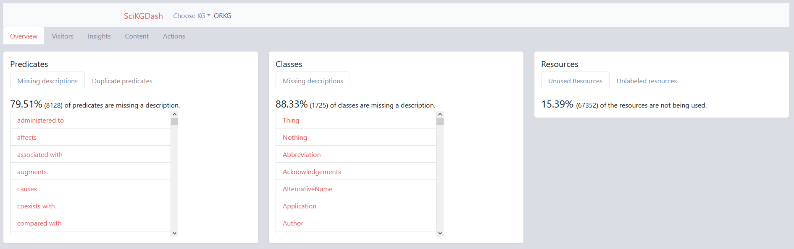
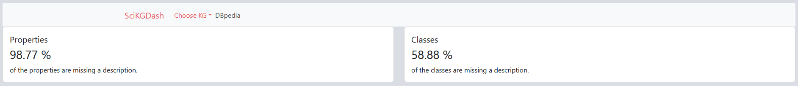
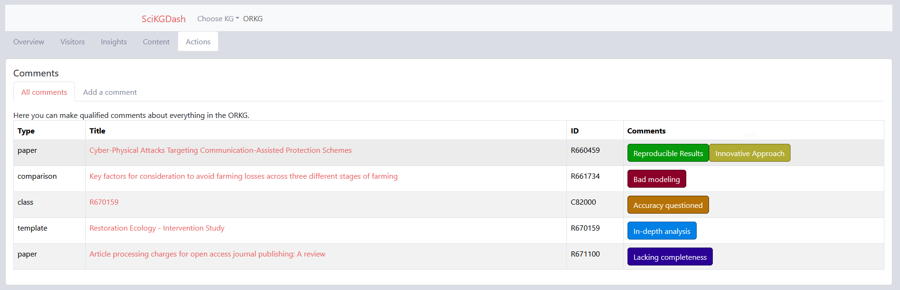
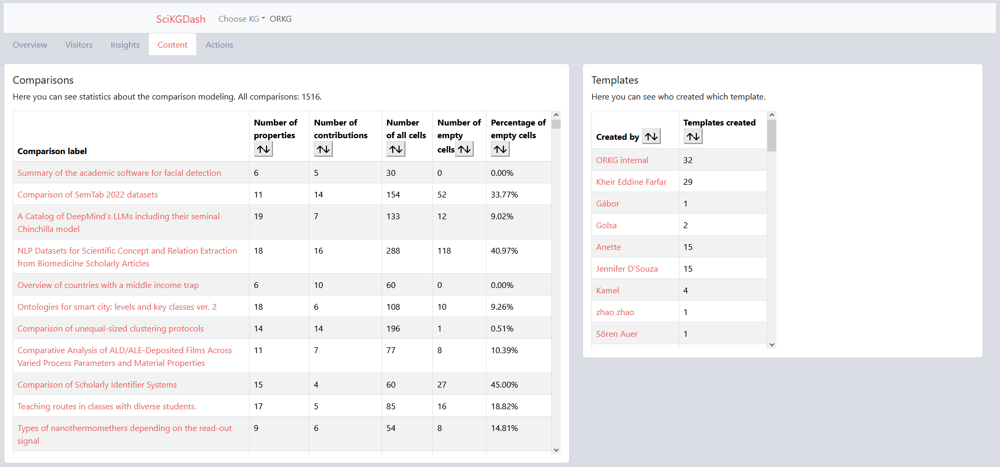
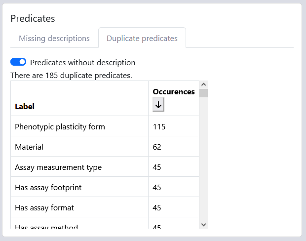
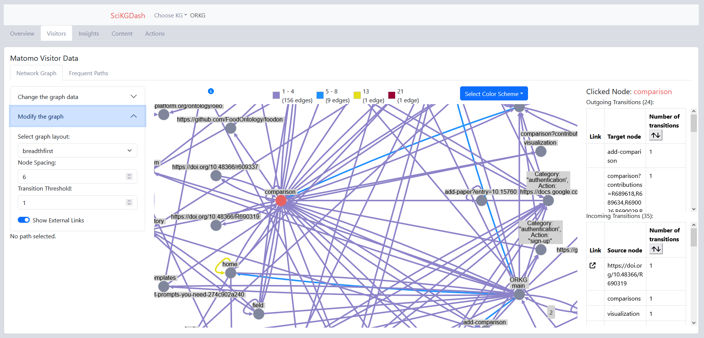
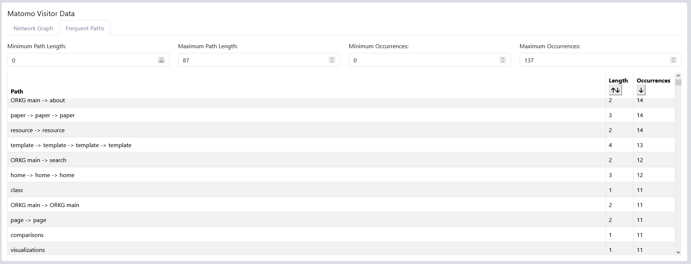
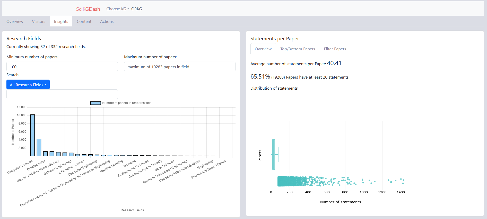
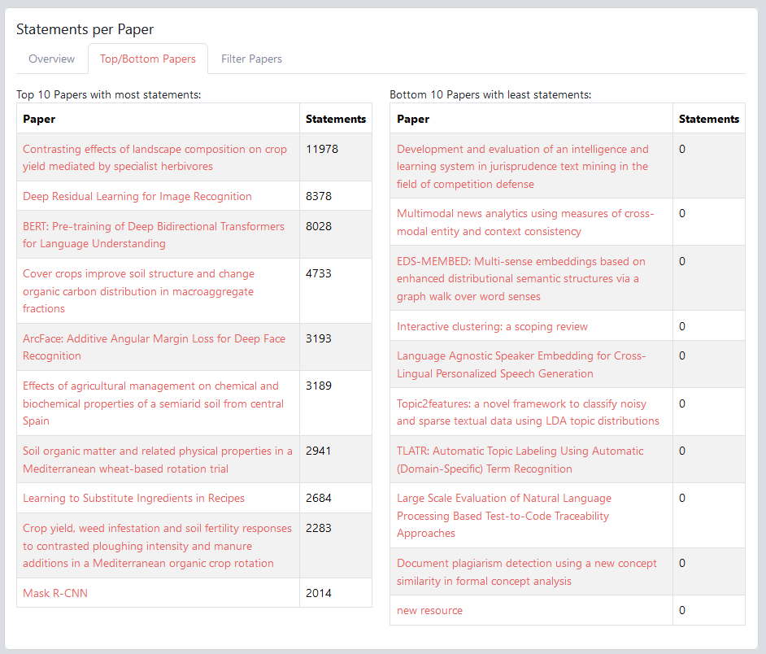

**SciKGDash** is a prototype dashboard for curating scientific knowledge graphs. Designed with curators of the [Open Research Knowledge Graph (ORKG)](https://www.orkg.org/), the tool provides an interactive interface to inspect, validate, and curate scientific entities within a knowledge graph.
It is designed to be modular and expandable to multiple knowledge graphs, for proof of concept, we integrated sample queries to [DBpedia](https://www.dbpedia.org/).

#### Features

- Visualize entities and relationships in scientific knowledge graphs
- Annotate, and curate graph data
- prototype built for extensibility and integration with multiple knowledge graphs

#### Screenshots

